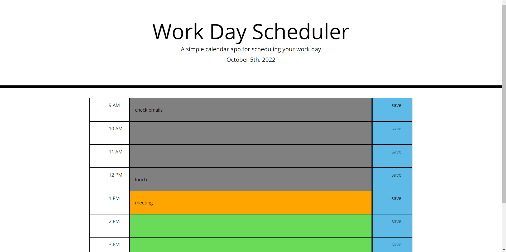

# Work Scheduler
This application allows you to see your work day (9AM-5PM) and plan tasks in those hour blocks

## installation
There is no installation required/ This application can be accessed in any web browser at this url: https://killingsworth-kristen.github.io/work-day-scheduler/

## Usage
On page load the header is updated with the current date. If this is the first time visiting this page the text area blocks will be bank, but if the user has put in tasks before those will be on the page on page load. As time passes the time blocks will turn gray, the current time block will be highlighted in orange, and future hour blocks will be highlighted in green. To put a task on the calendar, click on the area in the middle and type out your text. To sva ethis task to local storage (so that it reappers even if you close/reopen/reload) you must clikc the corresponding save button for that time block. If you wish to delete an item you can click into the text area and delete it and save again. 

## Credits 
I was given starter code by the University of Washington coding bootcamp. My contributions included a few CSS style elements which have been marked in the CSS stylesheet. Additionally, I built the HTML framework for the main section of the page (the timeblocks). The entirety of the javascript was written by me. 